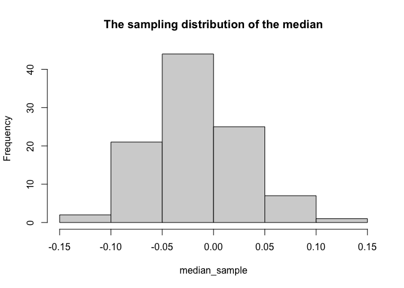

writeup
================

# Coverage probability

Coverage probability is an important operating characteristic of methods
for constructing interval estimates, particularly confidence intervals.

Definition: For the purposes of this deliverable, define the 95%
confidence interval of the median to be the middle 95% of sampling
distribution of the median. Similarly, the 95% confidence interval of
the mean, standard deviation, etc. is the middle 95% of the respective
sampling distribution.

``` r
library(tidyverse)
```

    ## ── Attaching packages ─────────────────────────────────────── tidyverse 1.3.1 ──

    ## ✓ ggplot2 3.3.5     ✓ purrr   0.3.4
    ## ✓ tibble  3.1.6     ✓ dplyr   1.0.7
    ## ✓ tidyr   1.1.4     ✓ stringr 1.4.0
    ## ✓ readr   2.1.0     ✓ forcats 0.5.1

    ## ── Conflicts ────────────────────────────────────────── tidyverse_conflicts() ──
    ## x dplyr::filter() masks stats::filter()
    ## x dplyr::lag()    masks stats::lag()

``` r
library(stats4)
```

## step 1

Generate a single sample from a standard normal distribution of size N =
201. Explain to the reader how you use MLE to estimate the distribution.

``` r
set.seed(111)
single_sample = rnorm(201, 0, 1)
fun <- function(a, b)
  sum(-log(dnorm(single_sample, a, b)))
z <- mle(minuslogl = fun, start = list(a = 0, b = 1))
mean = coef(z)[1]
sd = coef(z)[2]
mean
```

    ##           a 
    ## -0.01625532

``` r
sd
```

    ##        b 
    ## 1.037693

## step 2

Show the reader how you approximate the sampling distribution of the
median, conditional on the estimate of the distribution in the previous
step.

``` r
median_sample <- c()
for (i in 1:100) {
  x = median(rnorm(1000, mean, sd))
  median_sample <- c(median_sample, x)
}
hist(median_sample)
```

<!-- -->

## step 3

Describe how you calculate a 95% confidence interval from the
approximated sampling distribution.

``` r
ci = quantile(median_sample, probs = c(0.025, 0.975))
ci
```

    ##        2.5%       97.5% 
    ## -0.09332827  0.06888463

## step 4

Explain the concept of coverage probability. Explain your code for
calculating the coverage probability.

``` r
coverage <- c()
for (i in 1:1000) {
  data <- rnorm(201, 0, 1)
  
  mean = mean(data)
  sd = sqrt(length(data-1)/length(data)*var(data))
  
  median_sample <- c()
  for (i in 1:100) {
  x = median(rnorm(201, mean, sd))
  median_sample <- c(median_sample, x)
  }
  
  ci = quantile(median_sample, probs = c(0.025, 0.975))
  
  coverage <- c(coverage, ci[1] <= 0 & ci[2] >= 0)
}

mean(coverage)
```

    ## [1] 0.97

``` r
coverage <- c()
for (i in 1:1000) {
  data <- rnorm(201, 0, 1)
  
  median_sample <- c()
  for (i in 1:100) {
  x = median(sample(data, size = 201, replace = TRUE))
  median_sample <- c(median_sample, x)
  }
  
  ci = quantile(median_sample, probs = c(0.025, 0.975))
  
  coverage <- c(coverage, ci[1] <= 0 & ci[2] >= 0)
}

mean(coverage)
```

    ## [1] 0.925
