Final Exam
================

# Instructions

The final exam will be a one-on-one oral exam with the instructor.
Please meet the instructor near the “fish-bowl” office in the Data
Science Institute lobby. The exam will be recorded in Zoom. Please
prepare solutions to the following is a set of questions. During the
oral exam, the instructor will ask a series of questions covering topics
from the course and the questions. For example, the instructor may ask:

1.  Please explain how you solved a particular question.
2.  Please solve a new question (perhaps closely related to a question
    below).
3.  Please explain course topic X.

You will be graded on both the accuracy of your responses and the
clarity with which you explain course concepts and solutions to
questions.

The final exam should represent your own work. Do not consult with or
collaborate in any way with anyone other than the instructor.

Prior to meeting with the instructor, you should:

-   Create a folder in your Probability and Inference Portfolio; call it
    `99-final-exam`.
-   Compile, save, and push your solutions to your GitHub repository

# 1. Simulation

The Monte Hall problem is a classic game show. Contestants on the show
where shown three doors. Behind one randomly selected door was a
sportscar; behind the other doors were goats.

At the start of the game, contestants would select a door, say door A.
Then, the host would open either door B or C to reveal a goat. At that
point in the game, the host would ask the contestant if she would like
to change her door selection. Once a contestant decided to stay or
change, the host would open the chosen door to reveal the game prize,
either a goat or a car.

In this problem, consider a **modified** version of the Monte Hall
problem in which the number of doors is **variable**. Rather than 3
doors, consider a game with 4 or 5 or 50 doors. In the modified version
of the game, a contestant would select an initial door, say door A.
Then, the host would open **one** of the remaining doors to reveal a
goat. At that point in the game, the host would ask the contestant if
she would like to change her door selection. Once a contestant decided
to stay or change, the host would open the chosen door to reveal the
game prize, either a goat or a car.

Consider two strategies:

1.  Always stay with the first door selected.
2.  Always switch to the unopened door.

**C.** The function `game` below plays a single game of Monte Hall. The
function returns a vector of length two, the first element is the prize
under strategy 1 and the second element is the prize under strategy 2.
The function has a single input parameter, N, which is the number of
doors in the game.

Use the `game` function to estimate the probability that both strategies
result in a goat. Let **N=4**.

``` r
require(magrittr)
```

    ## Loading required package: magrittr

``` r
require(dplyr)
```

    ## Loading required package: dplyr

    ## 
    ## Attaching package: 'dplyr'

    ## The following objects are masked from 'package:stats':
    ## 
    ##     filter, lag

    ## The following objects are masked from 'package:base':
    ## 
    ##     intersect, setdiff, setequal, union

``` r
game <- function(N){
  if(N<3) stop("Must have at least 3 doors")
  prize <- sample(c(rep("goat",N-1),"car"), N)
  guess <- sample(1:N,1)
  game <- data.frame(door = 1:N, prize = prize, stringsAsFactors = FALSE) %>% 
    mutate(first_guess = case_when(
      door == guess ~ 1
      , TRUE ~ 0
    )) %>% 
    mutate(potential_reveal = case_when(
        first_guess == 1 ~ 0
      , prize == "car" ~ 0
      , TRUE ~ 1
    )) %>% 
    mutate(reveal = 1*(rank(potential_reveal, ties.method = "random") == 3)) %>% 
    mutate(potential_switch = case_when(
      first_guess == 1 ~ 0
      , reveal == 1 ~ 0
      , TRUE ~ 1
    )) %>% 
    mutate(switch = 1*(rank(potential_switch, ties.method = "random") == 3))
  c(game$prize[game$first_guess == 1], game$prize[game$switch == 1])
}
```

``` r
set.seed(1)
result1 <- replicate(1e3, game(N = 4)[1]) 
probability1 <- result1 %>% table() %>% prop.table() %>% as.data.frame() %>% .[2,2]
probability1
```

    ## [1] 0.759

``` r
# The probability for strategy1 results in a goat is 0.759

result2 <- replicate(1e3, game(N = 4)[2]) 
probability2 <- result2 %>% table() %>% prop.table() %>% as.data.frame() %>% .[2,2]
probability2
```

    ## [1] 0.634

``` r
# The probability for strategy2 results in a goat is 0.634
```

**B**. Communicate the precision of your simulated probability in part
**C** by calculating a **99%** confidence interval.

Strategy1

``` r
prop.test(probability1*1e3, 1e3, probability1, alternative = "two.sided", conf.level = 0.99)
```

    ## 
    ##  1-sample proportions test without continuity correction
    ## 
    ## data:  probability1 * 1000 out of 1000, null probability probability1
    ## X-squared = 0, df = 1, p-value = 1
    ## alternative hypothesis: true p is not equal to 0.759
    ## 99 percent confidence interval:
    ##  0.7225285 0.7920573
    ## sample estimates:
    ##     p 
    ## 0.759

``` r
# The 99% confidence interval for the probability of strategy1 is [0.7225285, 0.7920573]
```

strategy2

``` r
prop.test(probability2*1e3, 1e3, probability2, alternative = "two.sided", conf.level = 0.99)
```

    ## 
    ##  1-sample proportions test without continuity correction
    ## 
    ## data:  probability2 * 1000 out of 1000, null probability probability2
    ## X-squared = 0, df = 1, p-value = 1
    ## alternative hypothesis: true p is not equal to 0.634
    ## 99 percent confidence interval:
    ##  0.5939988 0.6722348
    ## sample estimates:
    ##     p 
    ## 0.634

``` r
# The 99% confidence interval for the probability of strategy2 is [0.5939988, 0.6722348]
```

**A**. Let D(N) be the difference between the difference in
probabilities between strategy 2 and strategy 1.

*D*(*N*) = *P*(win strategy 2\|N doors) − *P*(win strategy 1\|N doors)
Create a plot that shows how D changes as N increases. Put N on the
x-asis, ranging from 3 to 10. Put D on the y-axis.

``` r
set.seed(10)
x <- seq(3,10,1)
y <- c()
for (i in x) {
probability1 <- replicate(1e3, game(N = i)[1]) %>% table() %>% prop.table() %>% as.data.frame() %>% .[1,2]
probability2 <- replicate(1e3, game(N = i)[2]) %>% table() %>% prop.table() %>% as.data.frame() %>% .[1,2]
D = probability2 - probability1
y <- c(y, D)
}
plot(x, y, main = "Relationship between number of doors and difference in probabilities", xlab = "number of doors", ylab = "difference in probabilities", type = "b")
```

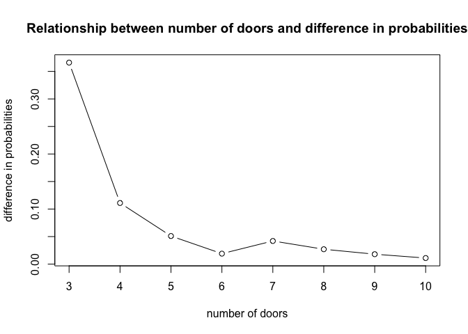<!-- --> The plot
makes sense. When you choose the strategy1, the probability of winning
the game is $\\frac{1}{N}$. When you choose strategy2, the probability
of winning the game is $\\frac{N-1}{N(N-2)}$. As the increasing of N,
the difference between (N-1) and (N-2) getting smaller, and the
difference between the two probabilities getting smaller.

# 2. Probability

Consider a test for a rare genetic condition. Let T+ denote a test
result that indicates the condition is present, while T- denotes
absence. Let D+ and D- denote the true status of the disease.

**C**. Fill-in the probability table using the following information:

-   P(T+\|D+) = .85, and
-   P(T-\|D-) = .95, and
-   P(D+) = 0.001

|     |  D+   | D-  |     |
|:---:|:-----:|:---:|:---:|
| T+  |       |     |     |
| T-  |       |     |     |
|     | 0.001 |     |  1  |

|     |   D+    |   D-    |        |
|:---:|:-------:|:-------:|:------:|
| T+  | 0.00085 | 0.04995 | 0.0508 |
| T-  | 0.00015 | 0.94905 | 0.9492 |
|     |  0.001  |  0.999  |   1    |

**B**. Calculate the **negative** predictive value of the test,
P(D-\|T-). We can get the table as:

|                        |   D+    |   D-    | row total |
|:----------------------:|:-------:|:-------:|:---------:|
|  T+ (cell proportion)  | 0.00085 | 0.04995 |  0.0508   |
|  T+ (row proportion)   | 0.01673 | 0.98327 |           |
| T+ (column proportion) |  0.85   |  0.05   |           |
| T- (cell proportion )  | 0.00015 | 0.94905 |  0.9492   |
|  T- (row proportion)   | 0.00016 | 0.99984 |           |
| T- (column proportion) |  0.15   |  0.95   |           |
|      column total      |  0.001  |  0.999  |     1     |

$$
p(D-) = 1 - P(D+) = 1 - 0.001 = 0.999
P(D- & T-) = P(T-\|D-)\*P(D-) = 0.95\*0.999 = 0.94905
P(T-\|D+) = 1 - P(T+\|D+) = 1 - 0.85 = 0.15
P(D+ & T-) = P(T-\|D+)\*P(D+) = 0.15\*0.001 = 0.00015
P(T-) = P(D- & T-) + P(D+ & T-) = 0.94905 + 0.00015 = 0.9492
P(D-\|T-) = P(D- & T-)/P(T-) = 0.94905/0.9492 = 0.99984
$$

**A** Create a plot that shows how the **positive** predictive value as
a function of the prevalence of disease, P(D+).

``` r
prob_tp_dp = .85
prob_tn_dn = .95
prevalence <- seq(0.001, 0.1, length = 50)
prob_dptp <- prevalence * prob_tp_dp
prob_dn <- 1 - prevalence
prob_tp_dn <- 1 - prob_tn_dn
prob_tpdn <- prob_tp_dn * prob_dn
prob_tp <- prob_tpdn + prob_dptp
ppv <- prob_dptp/prob_tp
plot(prevalence, ppv, main = "Relationship betweenPrevalence and PPV", xlab = "Prevalence", ylab = "PPV")
```

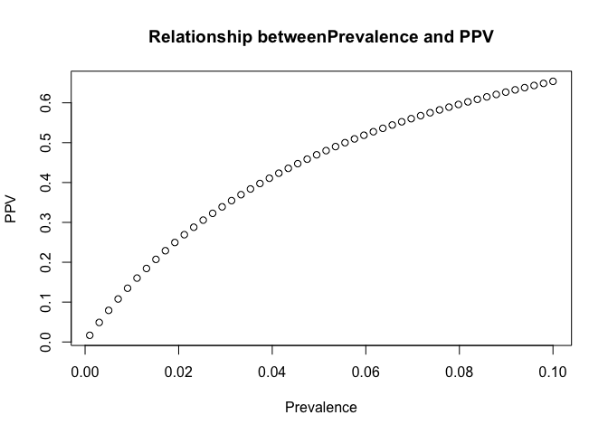<!-- -->

# 3. Discrete Distributions

Suppose the yearly hospital charges (in thousands of dollars) for a
randomly selected Vanderbilt student is a mixture distribution.

For 50% of students, the hospital charges will be $0. For the remaining
50% of students, the hospital charges are a random variable described by
a gamma distribution with shape = 2 and scale = 2. (Again, in thousands
of dollars.)

``` r
hospital_charges <- function(N){
  group <- rbinom(N, 1, 0.5)
  charges <- 0*group + rgamma(N, shape = 2, scale = 2)*(1-group)
  charges
}
```

**C**. What is the 90th percentile for yearly hospital charges for a
randomly selected Vanderbilt student?

``` r
set.seed(3)
quantile(hospital_charges(1000), probs = 0.9)
```

    ##      90% 
    ## 5.534398

``` r
# The 90th percentile for yearly hospital charges for a randomly selected Vanderbilt student is 5.534398 
```

**B**. Consider the **class** average yearly hospital charge for the
students in a class of size 30. Plot the density function or a simulated
histogram of the class average yearly hospital charge.

``` r
set.seed(5)
class <- c()
for (i in 1:1e3) {
  class <- c(class, mean(hospital_charges(30)))
}
plot(density(class), main = "The density of average yearly hospital charge of a class", xlab = "average yearly hospital charges")
```

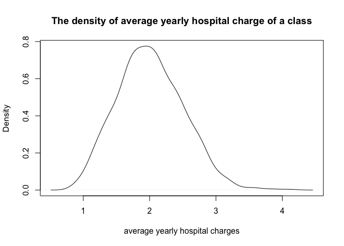<!-- -->

``` r
hist(class, main = "The histogram of average yearly hospital charge of a class", xlab = "average yearly hospital charges")
```

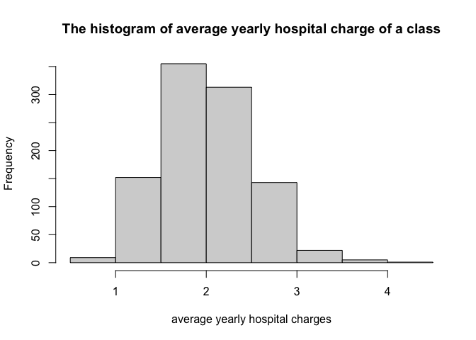<!-- -->

**A**. What is the probability that a randomly selected class of size 30
students will have less than 10 students with zero yearly hospital
charges?

``` r
set.seed(6)
rate = 0
for(i in 1:1e3){
  class = hospital_charges(30)
  if(sum(class == 0) < 10){
    rate = rate  + 1
  }
}
rate/1e3
```

    ## [1] 0.023

``` r
# The simulated probability that a randomly selected class of size 30 students will have less than 10 students with zero yearly hospital charges is 0.023
```

# 4. Continuous Distributions

**C.** Suppose diastolic blood pressure (DBP) follows a normal
distribution with mean 80 mmHg and SD 15 mmHg. What is the probability
that a randomly sampled person’s DBP lies between 70 and 104 mmHg?

``` r
prob = pnorm(104, mean = 80, sd = 15) - pnorm(70, mean = 80, sd = 15)
prob
```

    ## [1] 0.6927082

``` r
# The probability that a randomly sampled person's DBP lies between 70 and 104 mmHg is 0.6927082.
```

**B.** Suppose a human femur was discovered that is 37 cm long. Also
suppose that using the NHANES data, researchers believe the distribution
of femur bones, by sex, are distributed as follows:

-   Female adult femur  ∼ *N*(36,3.3)
-   Male adult femur  ∼ *N*(40,3.4)

Under the assumption that male and females are equally likely, what is
the probability that the discovered femur was from a male?

``` r
prob_male = dnorm(37, 40, sqrt(3.4))
prob_female = dnorm(37, 36, sqrt(3.3))
prob_from_male = prob_male/(prob_male + prob_female)
prob_from_male
```

    ## [1] 0.2338065

``` r
# The probability that the discovered femur was from a male is 0.2338065.
```

**A.** Continuing part **B**, generate a plot of P(femur from male \|
femur length = x). Let femur length range from 25 to 50.

``` r
femur_length <- 25:50
prob_male <- dnorm(femur_length, 40, sqrt(3.4))/(dnorm(femur_length, 40, sqrt(3.4)) + dnorm(femur_length, 36, sqrt(3.3)))
plot.new()
plot.window(xlim = c(25,50), ylim = c(0,1))
lines(femur_length, prob_male)
axis(1)
axis(2)
box()
title(xlab = "Femur Length", ylab = "P(Male | femur length)")
```

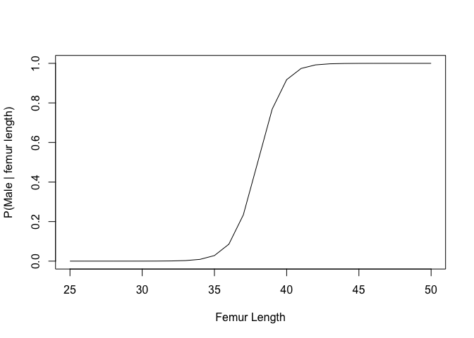<!-- -->

# 5. Expectation and Variance

Let us revisit the yearly hospital charges distribution from a previous
section.

> **Recall:** The yearly hospital charges (in thousands of dollars) for
> a randomly selected Vanderbilt student is a mixture distribution. For
> 50% of students, the hospital charges will be $0. For the remaining
> 50% of students, the hospital charges are a random variable described
> by a gamma distribution with shape = 2 and scale = 2. (Again, in
> thousands of dollars.)

``` r
hospital_charges <- function(N){
  group <- rbinom(N, 1, 0.5)
  charges <- 0*group + rgamma(N, shape = 2, scale = 2)*(1-group)
  charges
}
```

**C.** What is E\[yearly hospital charges\]?

``` r
set.seed(8)
mean_charge <- c()
for (i in 1:1e3) {
  mean_charge <- c(mean_charge, mean(hospital_charges(1e4)))
}
mean(mean_charge)
```

    ## [1] 2.000392

``` r
# The simulated expectation of yearly hospital charges is 2.000392.
```

**B.** Suppose Vanderbilt implements a cap of $10,000 on yearly student
hospital charges. What is the mean yearly hospital charge under the new
policy?

``` r
set.seed(88)
mean_charge_new <- c()
for (i in 1:1e3) {
  charge_fee <- hospital_charges(1e4)
  charge_fee[charge_fee >= 10] <- 10
  mean_charge_new <- c(mean_charge_new, mean(charge_fee))
}
mean(mean_charge_new)
```

    ## [1] 1.953968

``` r
# The simulated expectation of yearly hospital charge under the new policy is 1.953968.
```

**A.** What is the variance of yearly hospital charge under the new
policy?

``` r
set.seed(888)
var_charge_new <- c()
for (i in 1:1e3) {
  charge_fee <- hospital_charges(1e4)
  charge_fee[charge_fee >= 10] <- 10
  var_charge_new <- c(var_charge_new, var(charge_fee))
}
mean(var_charge_new)
```

    ## [1] 7.024844

``` r
# The variance of yearly hospital charge under the new policy is 7.024844.
```

# 6. Transformations & Sampling Distributions

**C.** Consider the log normal distribution. If X is a log normal random
variable, then log(X) is a normal random variable. One way to create
pseudo-random draws from the log normal distribution is to generate
draws from a normal distribution and then to transform the draws by
exponentiating. The parameters of the log normal distribution are the
parameters of the underlying normal distribution, *μ* and *σ* (or
*σ*<sup>2</sup>).

Log normal data are prevalent is biological systems and econometrics.

Suppose a blood chemistry measure has a log normal distribution with *μ*
= 0 and *σ* = 1. Generate an histogram or density curve for the sampling
distribution of the median when the sample size is 101.

``` r
set.seed(10)
data <- c()
for (i in 1:1e3) {
  data <- c(data, median(rlnorm(101)))
}
plot(density(data), main = "Density curve for the sampling distribution of the median")
```

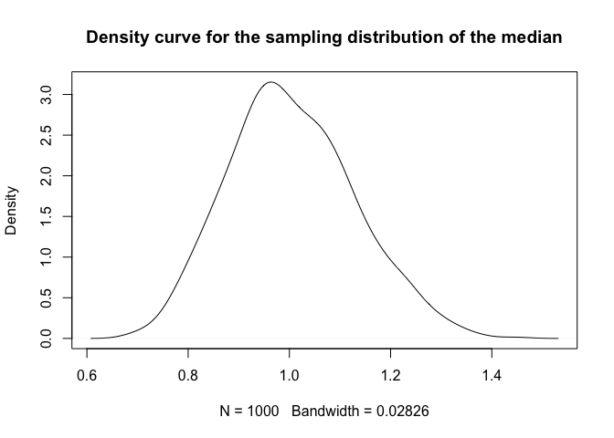<!-- -->

``` r
hist(data, main = "Histogram for the sampling distribution of the median")
```

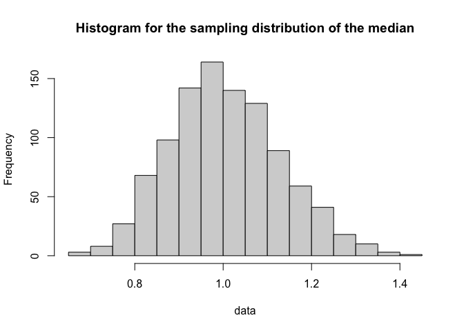<!-- -->

**B.** Below is the CDF function for the kth order statistic when the
underlying distribution is log normal with *μ* = 0 and *σ* = 1. Create a
plot of the ECDF of the simulated sampling distribution generated in
**C** and overlay the CDF using the function below.

``` r
Fk <- function(x,k,n){
  pbinom(k-1, n, plnorm(x), lower.tail = FALSE)
}
plot(ecdf(data), main = "Ecdf and cdf of the median", ylab = "probability")
curve(Fk(x, 51, 101), add = TRUE, col = "red")
legend("bottomright", legend = c("cdf", "ecdf"), lty = 1, col = c("red", "black"))
```

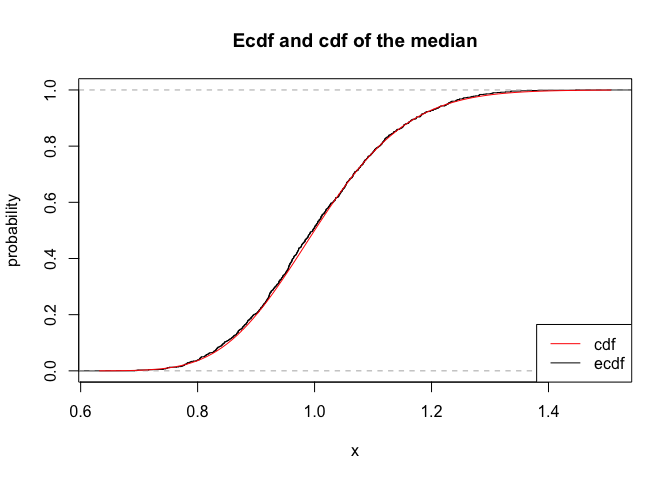<!-- -->

**A.** Of the 25th, 50th, and 75th quantiles of the distribution from
**B**, which will have the tightest 95% CI? (Show the sampling
distribution of each.)

``` r
set.seed(11)
quantile1 <- c()
quantile2 <- c()
quantile3 <- c()
for (i in 1:1e3) {
  data <- rlnorm(101, meanlog = 0, sdlog = 1)
  quantile1 <- c(quantile1, quantile(data, 0.25))
  quantile2 <- c(quantile2, quantile(data, 0.5))
  quantile3 <- c(quantile3, quantile(data, 0.75))
}
quantile(quantile1, c(0.025, 0.975))
```

    ##      2.5%     97.5% 
    ## 0.3961736 0.6665536

``` r
quantile(quantile2, c(0.025, 0.975))
```

    ##      2.5%     97.5% 
    ## 0.8054478 1.2717299

``` r
quantile(quantile3, c(0.025, 0.975))
```

    ##     2.5%    97.5% 
    ## 1.531382 2.544851

``` r
plot(density(quantile1), xlim = c(0.3, 2.6), main = "The sampling distribution of three quantiles", xlab = "x")
lines(density(quantile2), col = "red")
lines(density(quantile3), col = "green")
legend("topright", legend = c("25th quantile", "50th quantile", "75th quantile"), lty = 1, col = c("black", "red", "green"))
```

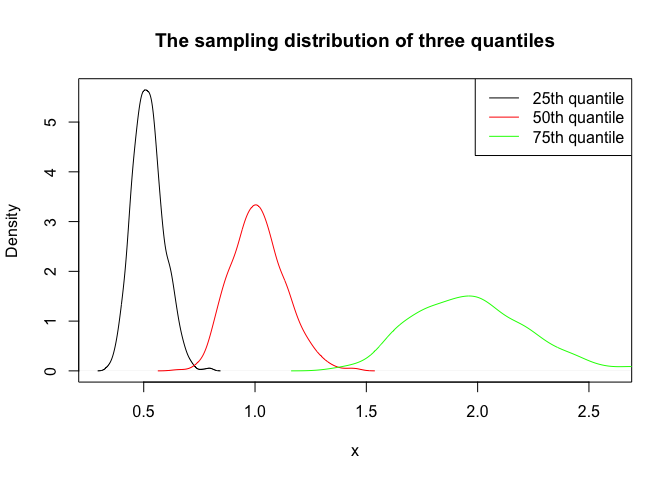<!-- -->

``` r
# From the plot and confidence intervals we got, we can get that the 25th quantile has the tightest 95% CI.
```

# 7. Estimation of CDF and PDF from data

The following code will load the NHANES data and select the first 500
rows.

``` r
Hmisc::getHdata(nhgh)
d1 <- nhgh[1:500,]
```

**C.** Estimate the distribution of standing height for adult (age \>
18) males using the MLE method with a normal distribution. Create a plot
of the estimated density function.

``` r
data <- d1 %>% filter(age > 18 & sex == "male") %>% pull(ht)
mu1 = mean(data)
sd1 = sd(data)
curve(dnorm(x, mean = mu1, sd = sd1), xlim = c(150, 200), main = "The estimated density of standing height for adult (age>18) males", xlab = "standing height", ylab = "density")
```

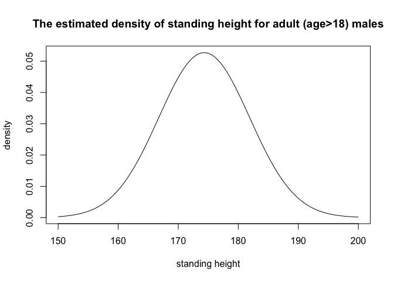<!-- -->

**B.** Estimate the distribution of BMI for adult (age \> 18) females
using using the method of moment method with the gamma distribution.
Create a plot of the estimated density function.

``` r
data2 <- d1 %>% filter(age > 18 & sex == "female") %>% pull(bmi)
mu2 <- mean(data2)
s2 <- var(data2)
shape1 <- mu2^2/s2
scale1 <- s2/mu2
curve(dgamma(x, shape = shape1, scale = scale1), xlim = c(0, 80), main = "The estimated density of BMI for adult (age>18) females", xlab = "BMI", ylab = "Density")
```

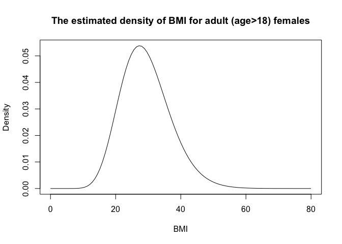<!-- -->

**A.** Estimate the distribution of creatinine (SCr) for adults (age \>
18) using the kernel density method with a Gaussian kernel. Create a
plot of the estimated density function.

``` r
data3 <- d1 %>% filter(age > 18 & !is.na(SCr)) %>% pull(SCr)
plot(density(data3, adjust = 2, kernel = "gaussian"), main = "The estimated density of SCr for adults", xlab = "SCr")
```

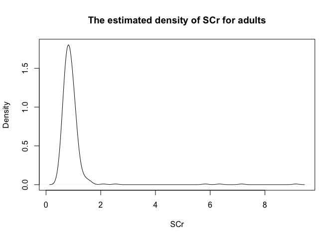<!-- -->

# 8. Sample from an estimated distribution

The following code will load the low birth weight data from the MASS
package. The description of the variables in the dataset can be found in
the birthwt documentation with the command `?MASS::birthwt`.

``` r
bwt <- MASS::birthwt
```

**C.** Generate a 95% confidence interval for the mean birthweight of
infants whose mothers **did** smoke during pregnancy using the
bootstrap.

``` r
set.seed(12)
data <- bwt %>% filter(smoke == 1) %>% pull(bwt)
mean_value <- c()
for (i in 1:1e3) {
  sample_data <- sample(data, size = 1e3, replace = TRUE)
  mean_value <- c(mean_value, mean(sample_data))
}
quantile(mean_value, c(0.025, 0.975))
```

    ##     2.5%    97.5% 
    ## 2732.709 2809.778

``` r
# The 95% CI for the mean birthweight of infants whose mothers did smoke during pregnancy using the bootstrap method is [2732.709, 2809.778 ].
```

**B.** Generate a 95% confidence interval for the mean birthweight of
infants whose mothers **did** smoke during pregnancy using the Central
Limit Theorem shortcut.

``` r
mu <- mean(data)
sd <- sd(data)
bottom = mu - 1.96*(sd/sqrt(length(data)))
top = mu + 1.96*(sd/sqrt(length(data)))
bottom
```

    ## [1] 2621.624

``` r
top
```

    ## [1] 2922.214

``` r
# The 95% CI for the mean birthweight of infants whose mothers did smoke during pregnancy using the Central Limit Theorem shortcut is [2621.624, 2922.214].
```

**A.** Let *μ*<sub>*s*</sub> be the mean birthweight of infants whose
mothers smoked during pregnancy. Let *μ*<sub>*n**s*</sub> be the mean
for the non-smoking group. Use simulation to calculate the 95%
confidence interval for *μ*<sub>*s*</sub>/*μ*<sub>*n**s*</sub>.

``` r
set.seed(13)
data <- bwt %>% filter(smoke == 1) %>% pull(bwt)
data1 <- bwt %>% filter(smoke == 0) %>% pull(bwt)
proportions <- c()
for (i in 1:1e3) {
  mu_s <- mean(sample(data, 1e3, replace = TRUE))
  mu_ns <- mean(sample(data1, 1e3, replace = TRUE))
  proportions <- c(proportions, mu_s/mu_ns)
}
quantile(proportions, c(0.025, 0.975))
```

    ##      2.5%     97.5% 
    ## 0.8881938 0.9276662

``` r
# The 95% CI is [0.8881938, 0.9276662 ].
```

# 9. Inference

**C.** Suppose two studies were performed looking at the risk of mild
complication after hernia repair using open and laparoscopic surgical
approaches. The study results are below. Using the data from each study
individually, perform the hypothesis test that the risk of complication
between open and laparoscopic repairs are the same under the usual point
null. What is the p-value from each study? What do you conclude from
each study?

| Study 1 | Comp | No comp |
|:--------|:-----|:--------|
| Open    | 30   | 70      |
| Lap     | 35   | 65      |

| Study 2 | Comp | No comp |
|:--------|:-----|:--------|
| Open    | 600  | 1400    |
| Lap     | 619  | 1381    |

study1

``` r
result1 <- prop.test(x = c(30, 35), n = c(100, 100))
result1
```

    ## 
    ##  2-sample test for equality of proportions with continuity correction
    ## 
    ## data:  c(30, 35) out of c(100, 100)
    ## X-squared = 0.36467, df = 1, p-value = 0.5459
    ## alternative hypothesis: two.sided
    ## 95 percent confidence interval:
    ##  -0.18963943  0.08963943
    ## sample estimates:
    ## prop 1 prop 2 
    ##   0.30   0.35

``` r
# The p-value is 0.5459. At the confidence level of 95%, we can conclude that there is no conclusive difference between the rates of mild complication after hernia repair using open and laparoscopic surgical approaches, in another word, the risk is the same.
```

study2

``` r
result2 <- prop.test(x = c(600, 619), n = c(2000, 2000))
result2
```

    ## 
    ##  2-sample test for equality of proportions with continuity correction
    ## 
    ## data:  c(600, 619) out of c(2000, 2000)
    ## X-squared = 0.3823, df = 1, p-value = 0.5364
    ## alternative hypothesis: two.sided
    ## 95 percent confidence interval:
    ##  -0.03852774  0.01952774
    ## sample estimates:
    ## prop 1 prop 2 
    ## 0.3000 0.3095

``` r
# The p-value is 0.5364. At the confidence level of 95%, we can conclude that there is no conclusive difference between the rates of mild complication after hernia repair using open and laparoscopic surgical approaches, in another word, the risk is the same.
```

**B.** Suppose that prior to the studies, the researchers established an
equivalence threshold of 6 percentage points. Using the confidence
intervals, which studies (if any) showed a conclusive similarity between
surgical approaches for the complication rate. Explain why.

``` r
result1$conf.int[2] - result1$conf.int[1]
```

    ## [1] 0.2792789

``` r
result2$conf.int[2] - result2$conf.int[1]
```

    ## [1] 0.05805547

``` r
# The second study showed a conclusive similarity between surgical approaches for the complication rate. As the length of the 95% confidence interval for the study 2 is 0.05805547, which is less than 0.06, so we regard that there is a conclusive similarity, while the 95% CI for the study 1 is 0.2792789, which is greater than 0.06, so we can detect there is a conclusive difference rather than a conclusive similarity.
```

**A.** If the data from the studies were combined, what is the smallest
equivalence threshold that would identify a conclusive similarity
between the surgical approaches?

``` r
result3 <- prop.test(c(630, 654), c(2100, 2100))
result3
```

    ## 
    ##  2-sample test for equality of proportions with continuity correction
    ## 
    ## data:  c(630, 654) out of c(2100, 2100)
    ## X-squared = 0.59341, df = 1, p-value = 0.4411
    ## alternative hypothesis: two.sided
    ## 95 percent confidence interval:
    ##  -0.03976899  0.01691185
    ## sample estimates:
    ##    prop 1    prop 2 
    ## 0.3000000 0.3114286

``` r
result3$conf.int[2] - result3$conf.int[1]
```

    ## [1] 0.05668084

``` r
# The smallest equivalence threshold that would identify a conclusive similarity between the surgical approaches is 0.05668084.
```

# 10. Joint Distributions

**C.** Fill in the blank. The sample correlation is a measure of
\_\_\_\_\_\_\_\_\_\_\_\_\_\_\_\_\_ association.

linear

**B.** Explain why predictions from a conditional distribution generally
have smaller prediction error than predictions from the marginal
distribution.

When the two variables are independent, the conditional distribution is
same as the marginal distribution, so the prediction error is same in
this situation. When the two variables are correlated, we usually use
the mean square error MSE to calculate the prediction error and a good
estimator is always an unbiased estimator. However, the predictions from
a conditional distribution tends to have a less variance so it has a
less mean square error than the predictions from the marginal
distribution.

**A.** Use the CLT shortcut to calculate the 95% confidence interval for
the correlation of arm circumference and arm length using the NHANES
dataset. Is the sample correlation a reasonable measure of association
for this data?

``` r
#Based on the CLT, we regard the data is from a population that has a normal distribution; Then, we can use the Pearson correlation coefficient and test the linear relationship between the two variables.
Hmisc::getHdata(nhgh)
cor.test(nhgh$armc, nhgh$arml, alternative = "two.sided")
```

    ## 
    ##  Pearson's product-moment correlation
    ## 
    ## data:  nhgh$armc and nhgh$arml
    ## t = 46.838, df = 6601, p-value < 2.2e-16
    ## alternative hypothesis: true correlation is not equal to 0
    ## 95 percent confidence interval:
    ##  0.4811147 0.5173282
    ## sample estimates:
    ##       cor 
    ## 0.4994396

``` r
#According to the test result, we can get the 95% confidence interval is [0.4811147,0.5173282]. The null hypothesis is that there is no linear relationship between "armc" and "arml". However, 0 is not in our 95% confidence interval. Also, the p-value we got is less than 2.2e-16. We can conclude that we need to reject the null hypothesis at the 99% confidence level, and the probability we made a type I error is 0.01. So the sample correlation, 0.4994396, is a reasonable measure of association for this data.
```
